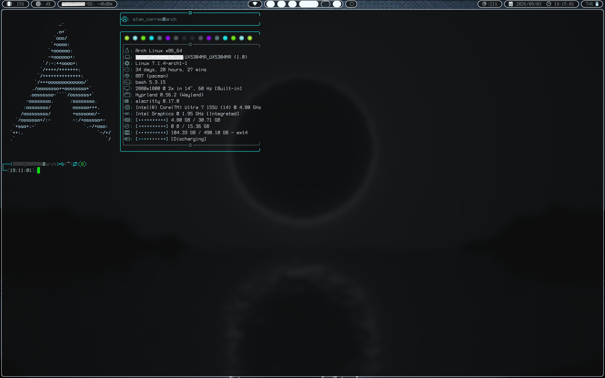
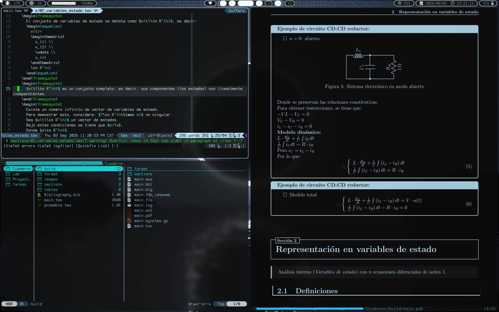

# Arch.config

⠀⠀⠀⠀⠀⠀⠀⠀⠀⠀⠀⠀⠀⣸⣇ \
⠀⠀⠀⠀⠀⠀⠀⠀⠀⠀⠀⠀⢰⣿⣿⡆ \
⠀⠀⠀⠀⠀⠀⠀⠀⠀⠀⠀⢠⣿⣿⣿⣿⡄ \
⠀⠀⠀⠀⠀⠀⠀⠀⠀⠀⠀⢿⣿⣿⣿⣿⣿⡄ \
⠀⠀⠀⠀⠀⠀⠀⠀⠀⢀⣷⣤⣙⢻⣿⣿⣿⣿⡀ \
⠀⠀⠀⠀⠀⠀⠀⠀⢀⣿⣿⣿⣿⣿⣿⣿⣿⣿⣿⡀ \
⠀⠀⠀⠀⠀⠀⠀⢠⣾⣿⣿⣿⣿⣿⣿⣿⣿⣿⣿⣷⡄ \
⠀⠀⠀⠀⠀⠀⢠⣿⣿⣿⣿⣿⡿⠛⠛⠿⣿⣿⣿⣿⣿⡄ \
⠀⠀⠀⠀⠀⢠⣿⣿⣿⣿⣿⠏⠀⠀⠀⠀⠙⣿⣿⣿⣿⣿⡄ \
⠀⠀⠀⠀⣰⣿⣿⣿⣿⣿⣿⠀⠀⠀⠀⠀⠀⢿⣿⣿⣿⣿⠿⣆ \
⠀⠀⠀⣴⣿⣿⣿⣿⣿⣿⣿⠀⠀⠀⠀⠀⠀⣿⣿⣿⣿⣿⣷⣦⡀ \
⠀⢀⣾⣿⣿⠿⠟⠛⠋⠉⠉⠀⠀⠀⠀⠀⠀⠉⠉⠙⠛⠻⠿⣿⣿⣷⡀ \
⣠⠟⠋⠁⠀⠀⠀⠀⠀⠀⠀⠀⠀⠀⠀⠀⠀⠀⠀⠀⠀⠀⠀⠀⠈⠙⠻⣄

> This repo contains the config files for __arch-linux__ with hyprland to take after __TRON__ aesthethics and also try to make it minimalist and efficient. You will also be able to integrate this distro with __Black-Arch__ repositories.
Most of the tools used in this repo are TUI or CLI tools, in order to keep the philosophy of keyboard efficiency with mouse-free navigation rather than point and click actions.
The porpuse of this repo is to give you an start point in arch-linux, so you can customize your linux distro and create your own repo for not losing your config files in case you lose your device or your operative system.
---

## ScreenShots
- Alacritty

- Neovim and compilig LaTeX code


---

## Main tools
+ Window Manager: [Hyprland](https://wiki.hypr.land)
+ Display Manager: [Ly](https://github.com/fairyglade/ly)
+ Terminal emulator: [Alacritty](https://alacritty.org/)
+ Shell: Bash
+ File Manager: [Yazi](https://yazi-rs.github.io/)
+ Text Editor/IDE: [NeoVim](https://neovim.io/)
+ PDF Viewer: [Zathura](https://pwmt.org/projects/zathura/)
+ Font: [TerminessNerdFont](https://www.nerdfonts.com/font-downloads)
+ Bar: [Waybar](https://waybar.net/)
+ Image Viewer: [Feh](https://feh.finalrewind.org/)
+ Media Player: [Smplayer](https://www.smplayer.info/)

---

## Preinstallation
> Whether you even do not know how to start, i will leave a tutorial document in spanish for the commands and adjustments i made in my device to install arch-linux manually.

---

## Installation

* Clone this GitHub repo in your `${HOME}` directory:
    ```bash
    git clone https://github.com/alan252003/Arch.config.git
    ```
* You may rename this repo as `.config` in your `${HOME}` directory and copy the other files you had in the original `.config` file:
    ```bash
    mv ${HOME}/Arch.config/* ${HOME}/.config/
    ```
    Optionally you can remove the repo directory:
    ```bash
    rm -r Arch.config
    ```
* Execute the `archinstall.sh` script to install all needed tools:
    ```bash
    sudo su
    ```
    ```bash
    bash ${HOME}/.config/scripts/archinstall.sh
    ```
> Read the script before you execute it.

---

## Keybindings

Keybinding | Command/Action | Description
--- | --- | ---
*SUPER* + ENTER | `alacritty`  | Spawns an alacritty terminal
SUPER + Q | killactive | Stops running process on the current window
SUPER + TAB | workspace, previous | Changes to the previous workspace you were in
SUPER + SPACE | `bash $menu search` | Executes a bash script for  dmenu to searh a program
SUPER + SHIFT + BACKSPACE | `bash $menu state` | Executes a bash script for dmenu whether you desire to power off or restart the system
SUPER + SHIFT + ESCAPE | `hyprlock -q` | Activates the screen lock
SUPER + SHIFT + B | `brave` | Inits a brave browser instance
SUPER + SHIFT + Q | `command -v hyprshutdown >/dev/null 2>&1 && hyprshutdown -o hyprctl dispatch exit` | Exits from hyprland environment
SUPER + SHIFT + R | `bash ${HOME}/.config/waybar/launch.sh` | Reloads hyprland configuration
SUPER + F | fullscreen | Makes fullscreen the current window
SUPER + S | `hyprctl dispatch togglefloating && hyprctl dispatch resizeactive exact 800 600 && hyprctl dispatch centerwindow` | Centers the current window as a floating window
SUPER + T | settiled | Makes the current window a tiled one whether it is in fullscreen or floating mode
SUPER + P | `bash ${HOME}/.config/scripts/screenshot select` | Executes a bash script to take a screenshot of the selected area
SUPER + W | `bash ${HOME}/.config/scripts/screenshot window` | Executes a bash script to take a screenshot of the current window
SUPER + M | `bash ${HOME}/.config/scripts/screenshot monitor` | Executes a bash script to take a screenshot of the current workspace
SUPER + C | `hyprctl keyword monitor HDMI-A-1, preferred, auto, 1, mirror, eDP-1` | Shares the current workspace to another screen device through HDMI
SUPER + h | movefocus, l | Moves the working focus to the left window
SUPER + l | movefocus, r | Moves the working focus to the right window
SUPER + k | movefocus, u | Moves the working focus to the upper window
SUPER + j | movefocus, d | Moves the working focus to the lower window
SUPER + SHIFT + h | movewindow, l | Moves the current window to the left
SUPER + SHIFT + l | movewindow, r | Moves the current window to the right
SUPER + SHIFT + k | movewindow, u | Moves the current window to the top
SUPER + SHIFT + j | movewindow, d | Moves the current window to the bottom
CTRL + SHIFT + h | resizeactive, -10 0 | Resizes the current window 10 pixels to the left
CTRL + SHIFT + l | resizeactive, 10 0 | Resizes the current window 10 pixels to the right
CTRL + SHIFT + k | resizeactive, 0 -10 | Resizes the current window 10 pixels to the top
CTRL + SHIFT + j | resizeactive, 0 10 | Resizes the current window 10 pixels to the bottom
SUPER + 1 | workspace, 1 | Moves the working focus to the workspace 1
SUPER + 2 | workspace, 2 | Moves the working focus to the workspace 2
SUPER + 3 | workspace, 3 | Moves the working focus to the workspace 3
SUPER + 4 | workspace, 4 | Moves the working focus to the workspace 4
SUPER + 5 | workspace, 5 | Moves the working focus to the workspace 5
SUPER + 6 | workspace, 6 | Moves the working focus to the workspace 6
SUPER + 7 | workspace, 7 | Moves the working focus to the workspace 7
SUPER + 8 | workspace, 8 | Moves the working focus to the workspace 8
SUPER + 9 | workspace, 9 | Moves the working focus to the workspace 9
SUPER + 0 | workspace, 10 | Moves the working focus to the workspace 10
SUPER + SHIFT + 1 | movetoworkspace, 1 | Moves the current workspace to the workspace 1
SUPER + SHIFT + 2 | movetoworkspace, 2 | Moves the current workspace to the workspace 2
SUPER + SHIFT + 3 | movetoworkspace, 3 | Moves the current workspace to the workspace 3
SUPER + SHIFT + 4 | movetoworkspace, 4 | Moves the current workspace to the workspace 4
SUPER + SHIFT + 5 | movetoworkspace, 5 | Moves the current workspace to the workspace 5
SUPER + SHIFT + 6 | movetoworkspace, 6 | Moves the current workspace to the workspace 6
SUPER + SHIFT + 7 | movetoworkspace, 7 | Moves the current workspace to the workspace 7
SUPER + SHIFT + 8 | movetoworkspace, 8 | Moves the current workspace to the workspace 8
SUPER + SHIFT + 9 | movetoworkspace, 9 | Moves the current workspace to the workspace 9
SUPER + SHIFT + 0 | movetoworkspace, 10 | Moves the current workspace to the workspace 10
